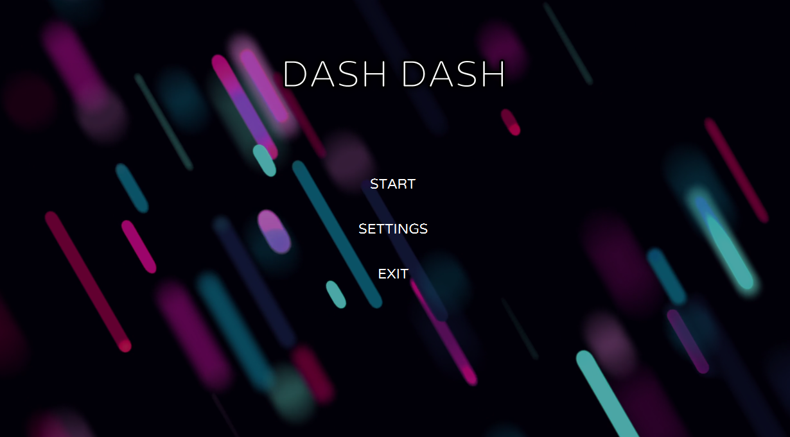
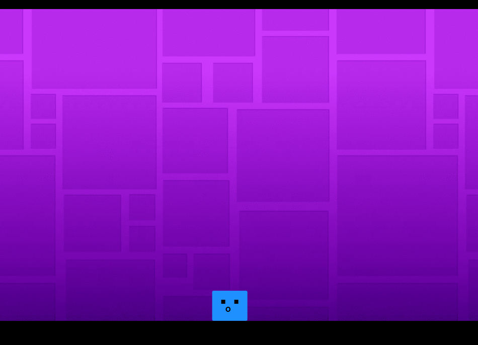

# DashDash

A fast-paced, gravity-flipping arcade runner built with JavaFX and FXGL.

## Description

DashDash is a side-scrolling "infinite runner" where the player controls a cube navigating through a hazardous environment. DashDash utilizes a gravity inversion mechanic pressing Space flips the player between the floor and ceiling.

## Getting Started

### Dependencies

* Java JDK 25
* Maven (To handle FXGL dependencies).
* Operating System: Windows 10/11, macOS, or Linux.

## Authors

Contributors names and contact info

Lead Developer - @Minkaln
[@Minkaln](https://www.facebook.com/profile.php?id=61565158614125)

Developer - @SakadareachMao
[@Sakadareach](https://www.facebook.com/sakadareach.mao)

Developer - @RickyRubixCube
[@RickyRubixCube]()

## License

This project is licensed under the MIT License - see the LICENSE.md file for details

## Acknowledgments

Inspiration, code snippets, etc.
* [flappy-birds](https://github.com/AlmasB/FXGLGames/tree/master/FlappyBird)
* [FXGL](https://github.com/AlmasB/FXGL)
* Developed with assistance from AI generation.
